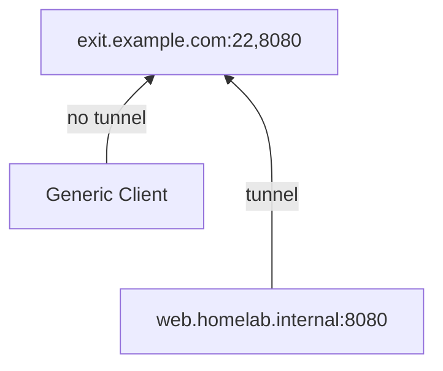
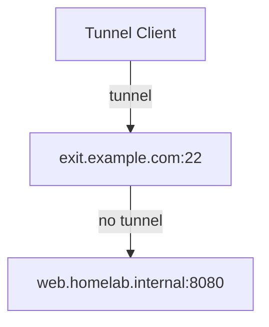
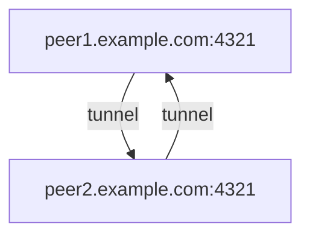
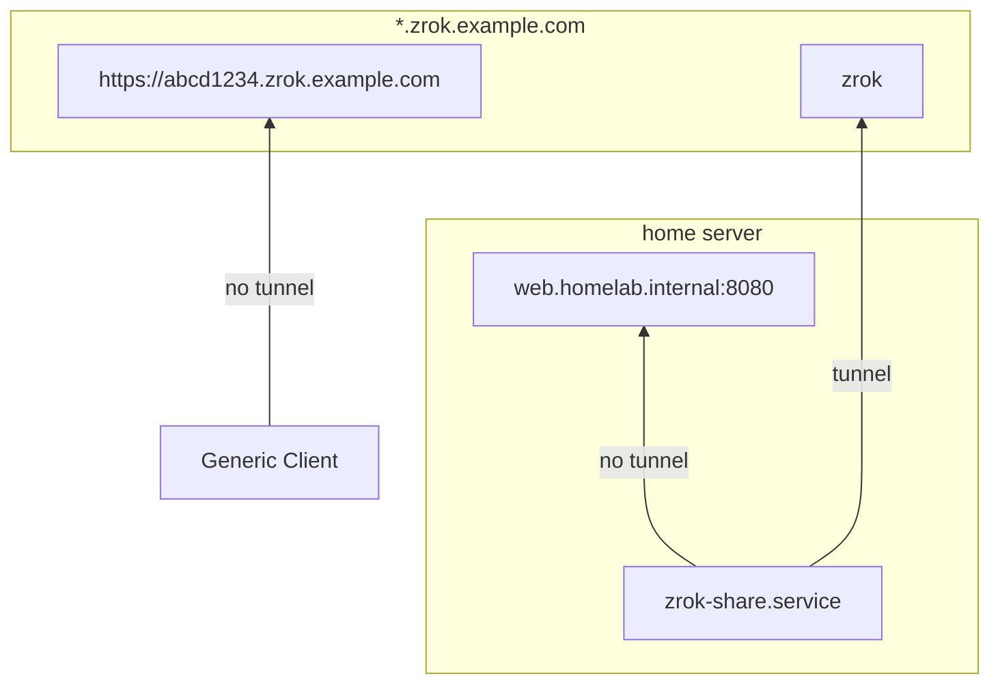
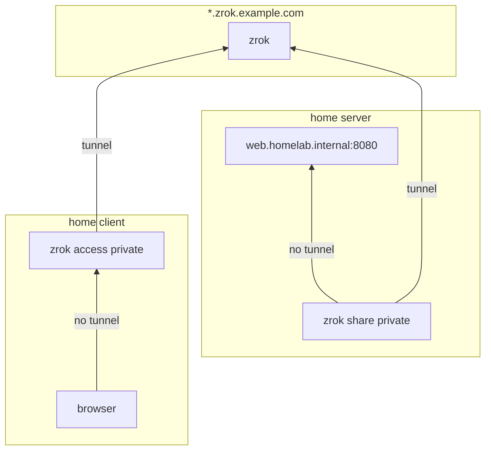
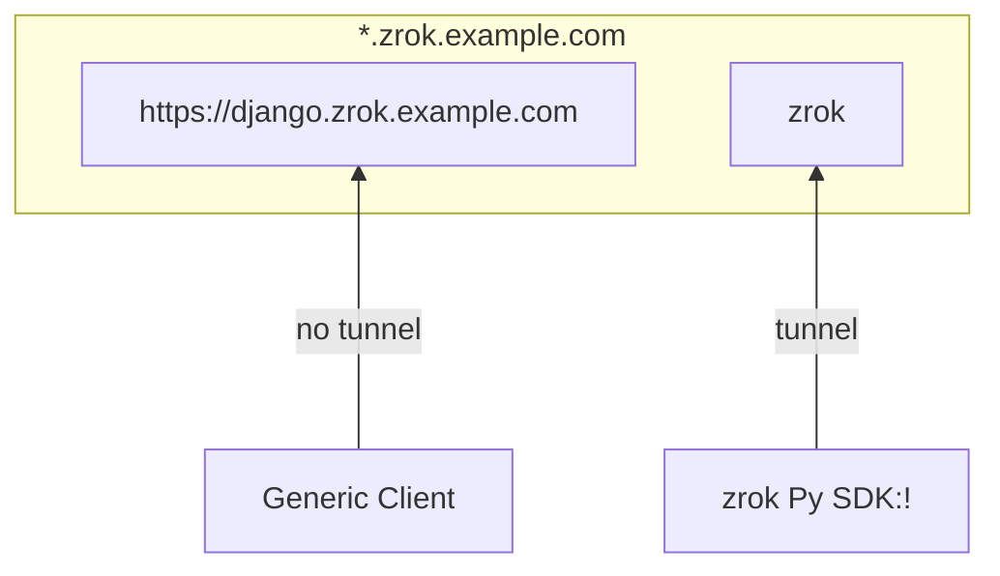
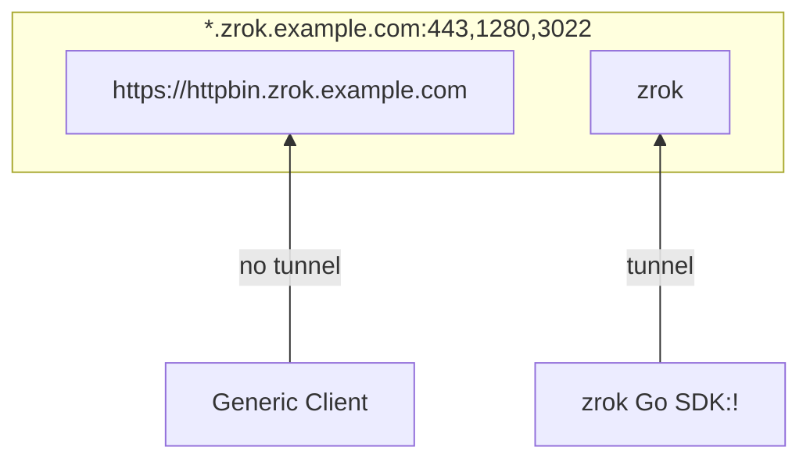

%% These slides are published as HTML and Markdown sources in https://qrk.us/pages/projects.html#patch-v-proxy %%

## Patch v. Proxy

*the ins and outs of fortified tunneling*

note: 

- Objectives
	- overview of tunneling methods with a focus on self-hosting
- Outline
	- motivations, values
	- techniques
	- case studies
- Surveys?


---

## Hello 

:wave:<!-- element class="emoji fragment fade-in" -->

::: block <!-- element class="fragment fade-in" align="center" -->

**Kenneth Bingham**

w@qrk.us | *@qrkourier*

:::

<style>
.emoji {
  font-size: 50px;
  display: inline-block;
  animation: rotate 9s infinite ease-in-out;
}

@keyframes rotate {
      0% {
        transform: rotate(10deg);
      }
      25% {
        transform: rotate(25deg);
      }
      50% {
        transform: rotate(0deg);
      }
      75% {
        transform: rotate(-10deg);
      }
      100% {
        transform: rotate(10deg);
      }
}
</style>

note:

- Day job is working on the OpenZiti community open-source project. Development is sponsored and led by NetFoundry Cloud
- personal interest in self-hosting

---

<!-- .slide bg="./patch-v-proxy/assets/mr-rabbit.png" -->

## How has Tunneling Changed?

*network-centric v. app-centric*

<grid drag="33 33" drop="1 -1" bg="black" opacity="50%" align="center"><!-- .element class="grid fragment fade-in" -->

**VPN**

public gateway to a private subnet or exit node

</grid>

<grid drag="33 33" drop="-1 1" bg="black" opacity="50%" align="center" pad="8"><!-- element class="fragment fade-in" -->

**Tunnel**

A public broker or relay for a private application

</grid>

note:

- for self-hosters, it's often less about building and bridging infrastructure and more about securing individual apps
- a bid for freedom from IP addresses
- vpns for full-tunnel exit node or split-tunnel corporate network

---

<!-- .slide bg="patch-v-proxy/assets/hand-wrench.png" -->


<grid drag="88 33" drop="top" bg="lightblue" opacity="70%" align="center" class="fragment fade-in">

### Access my own stuff

</grid>

<grid drag="88 33" drop="center" bg="lightblue" opacity="60%" align="center">

## Uses

</grid>

<grid drag="88 33" drop="bottom" bg="lightblue" opacity="70%" align="center" class="fragment fade-in">

### Share my stuff with ppl

</grid>

note:

- Motivations to talk about tunneling
	- ultimately: how do I
		- access the galaxy of free software through self-hosting?
		- apply values like privacy and self-sufficiency
	- tunneling can be a confusing means to an end
		- many tunneling projects and products
	- public good - Can we decentralize important services to make them more resilient or less adversarial (surveillance driven)?
- Access my stuff from wherever
	- examples
		- remote admin SSH
		- private Git repo
		- Home Assistant
		- offline AI models
		- catch webhooks for integrations
	- always available to me
	- admin everywhere
	- simple enough for me to remember how it works
	- dedicated capacity - few performance concerns 
- Share my stuff
	- examples
		- send a big file(s)
		- Jitsi conference 
		- play Minecraft
	- also simple enough for my users to remember how it works 
	- temporary availability is a compelling counterpoint to authN and authZ
- Inviting others
	- more expensive resources, QoS, or try again later...
	- segmenting access is more complicated with authN and authZ v. admin everywhere

---
<!-- .slide bg="patch-v-proxy/assets/toothbrush.png" -->

## Production <!-- element id="heading" -->

<grid drag="88 33" drop="bottom" bg="beige" opacity="70%" align="center" class="fragment fade-in">

::: block <!-- element id="block" -->

> There are as many standards as there are toothbrushes in the known universe.<!-- element id="quote" -->

:::

</grid>

<style>
	#heading{
		opacity: 80%;
		padding: 0.6em;
		font-size: 3em;
		background-color: beige;
		color: black;
	}
	#block{
		font-size: 33px;
		border-style: none;
	}
	#quote{
	}
</style>

note:

1. "production" is another way of saying "secure enough"
1. incremental security or begin with a more foundationally secure approach
   (instantly available for more useful, important things)
	1. start with permissive, eventually do a lot of work to create yet another permissive tunnel because it's challenging to qualify flows after they're in place
	2. start with restrictive and build meaningful policies for labeled entities as you go

---

<!-- .slide bg="./patch-v-proxy/assets/plumbing.png" -->

<grid drag="33 33" drop="center" flow="col" pad="0" bg="silver" opacity="0.8">


## The Plumbing 

</grid>

::: block <!-- element class="fragment fade-in" -->

<grid drag="33 33" drop="top" flow="col" pad="0" bg="silver" opacity="0.8">

### Provisioning

central v. distributed

</grid>

:::

::: block <!-- element class="fragment fade-in" -->

<grid drag="33 33" drop="bottom" flow="col" pad="0" bg="silver" opacity="0.8">

### Data

broker v. relay

transparent v. proxy

</grid>

:::

note:
- provisioning
	- central config, obedient daemons
	- agent-initiated (publish my file or socket)
- data
	- NAT-T broker facilitates direct P2P transport
		- service providers paying for bandwidth
		- ultra latency sensitive apps
	- 3p relay ideally has zero access to data
	- transport
		- TCP
		- UDP+flow control protocol
	- proxy
		- transparent w/ DNS (TPROXY v. ip route)
		- CONNECT, SOCKS, socket

---

<grid drag="50 50" drop="top">

## OpenSSH Reverse Tunnel

</grid>
<grid drag="50" drop="left">

```ssh
# public host sshd_config
GatewayPorts clientspecified
```

```bash
# server tunnel via public host
$ ssh -nNv \
    -R '*:8080:web.homelab.internal:8080' \
    user@exit.example.com
```

```bash
# generic client GET web.homelab.internal:8080
# by public DNS name
$ curl http://exit.example.com:8080
```

</grid>
<grid drag="50" drop="right">


</grid>

<style>
#ssh-reverse {
    transform: scale(1.4); /* Adjust the scale factor as needed */
    transform-origin: top left; /* Adjust the origin as needed */
}
</style>

note:

- pros
	- permissionless, generic client access
	- only SSH server is exposed
	- this is the closest to modern tunneling with SSH
- cons
	- no retry without glue
	- tedious incantation
	- intricate alignment of keys, addresses, and ports 

---

<grid drag="50 50" drop="top">

## OpenSSH Port Forward

</grid>

<grid drag="50" drop="left">

```bash
# client tunnel
$ ssh -nNv \
    -L '127.80.80.0:8080:web.homelab.internal:8080' \
	user@exit.example.com
```

```bash
# same device can GET web.homelab.internal:8080 
#  by forward IP:port
$ curl http://127.80.80.0:8080
```
</grid>

<grid drag="50" drop="right">


</grid>

<style>
#ssh-forward {
    transform: scale(1.4); /* Adjust the scale factor as needed */
    transform-origin: top left; /* Adjust the origin as needed */
}
</style>

note:

- my first tunnel?
- pros:
	- immediate, simple
- cons
	- no client side DNS
	- no retry without glue
	- tedious incantation for each forward
	- intricate alignment of keys, addresses, and ports 

---

<grid drag="50 50" drop="top">

## OpenSSH Dynamic Proxy

</grid>

<grid drag="50" drop="left">

```bash
# client tunnel
ssh -nNvD 1080 user@exit.example.com
```

```bash
# GET web.homelab.internal:8080
$ tsocks curl http://web.homelab.internal
```
</grid>
<grid drag="50" drop="right">


</grid>

<style>
#ssh-dynamic {
    transform: scale(1.6); /* Adjust the scale factor as needed */
    transform-origin: top left; /* Adjust the origin as needed */
}
</style>

note:

- example of direct, privilged access with bespoke client software
- pros:
	- SOCKS5 can forward DNS queries
- cons
	- 22/tcp is often blocked at egress
	- 22/tcp must be published to the internet
	- clients must be SOCKS aware
	- wrappers leverage LD_PRELOAD
	- intricate preconfiguration of pubkeys on each client

---

<grid drag="50 50" drop="top">

## Wireguard VPN

</grid>

<grid drag="50" drop="left">

```bash
# invent an address
ip address add dev wg0 10.0.0.1/24

# mutually authorized peers
wg set wg0 \
  listen-port 4321 \
  private-key /etc/wireguard/private.key \
  peer OxlmYnjEPfwVipblGPERvkWTJeORK9PO1MOFVkYll14= \
  allowed-ips 10.0.0.0/24 \
  endpoint peer2.example.com:4321
```

```bash
# peer can GET by IP
curl http://10.0.0.2:8080
```
</grid>

<grid drag="50" drop="right">


</grid>

</grid>


<style>
#wireguard {
    transform: scale(1.6); /* Adjust the scale factor as needed */
    transform-origin: top left; /* Adjust the origin as needed */
}
</style>

note:
- data plane for some modern VPNs with coordination planes
- pros
	- secure infrastructure - always on (with retry, no keepalive needed)
	- exposed ports are hardened and challenging to discover
- cons
	- no DNS OTS
	- peers must be continually exposed (no NAT-T without glue)
	- no orchestration OTS: intricate preconfiguration of pubkeys on each node

---

## Free Overlays

🔘 FOSS controller<br />
🔘 FOSS data plane<br />
🔘 FOSS agent or sdk

*a network on a network*

%% ::: block <!-- element style="font-size: 0.9em" --> %%

| project   | layer | transport       | context | default | license  |
| --------- | ----- | --------------- | ------- | ------- | -------- |
| ZeroTier  | 2     | custom (C++)    | user    | allow   | BSD-1    |
| Headscale | 3     | WireGuard-Go    | user    | allow   | BSD-3    |
| NetBird   | 3     | WireGuard   (C) | kernel  | allow   | BSD-3    |
| Nebula    | 3     | custom  (Go)    | user    | deny    | MIT      |
| OpenZiti  | 4     | custom  (C, Go) | user    | deny    | Apache-2 |


note:

- before we dive into tunnelers, honorable mention to "overlays"
	- "overlays" include mesh networks, modern VPNs
	- you might not need an overlay if you only need to tunnel a few services
	- overlays as a category are the way to go if you're building a platform, stack, or securing infrastructure...but start with a deny policy
- escape the IP address paradigm if you can (software-native socket)
- I have experience hosting OpenZiti if you have questions 
- I'd say the ones at layer 3 and below are mesh VPNs but I wouldn't call OpenZiti a VPN because it's based on applications, not IP networks
- the other major differences
	-  degrees of cloud native controllers and proxies
	- whether patching in a library is an option
	- some attempt NAT-T, but there are many caveats like mutual hard NATs and co-located peers behind CGNAT

---

## Freemium Tunnels

*commercial*

⚫ FOSS controller<br />
⚫ FOSS proxy<br />
🔘 FOSS agent or sdk

| product                           | public          | public authN | private        | sdk              | license     |
| --------------------------------- | --------------- | ------------ | -------------- | ---------------- | ----------- |
| CloudFlare Tunnel                 | tcp, udp, https | 🔘           |                |                  | Apache-2    |
| ngrok                             | tcp, https, tls | 🔘           |                | Go, Python, Rust | proprietary |
| Tailscale Funnel, Tailscale Serve | tcp, https      | ⚫           | http, tcp, tls |                  | BSD-3       |

note:

- not free
- run an agent to form a reverse tunnel to the provider's platform
- a verifiable TLS cert or TCP port for the service

---

## Free Tunnels

*self-hosted*

🔘 FOSS controller<br />
🔘 FOSS proxy<br />
🔘 FOSS agent or sdk

| project                  | public         | public authN | private                    | sdk                    | license          |
| ------------------------ | -------------- | ------------ | -------------------------- | ---------------------- | ---------------- |
| frp                      | tcp, udp, http | pw, oauth    |                            |                        | Apache-2         |
| localtunnel              | tcp            |              |                            | JS, Go, Py, Rust, Java | MIT              |
| teleport (Gravitational) |                |              | http, ssh, k8s, db, rdp    |                        | Apache-2, AGPL-3 |
| zrok (NetFoundry)        | http           | pw, oauth    | http, tcp, udp, socks, tun | Go, Python, Node.js    | Apache-2         |

note:

- free and self-hostable
- 


---

## Public Share

*agent tunnel*

```bash
zrok share public http://web.homelab.internal:8080
```




<style>
#zrok-public {
    transform: scale(1.8); 
    transform-origin: top center;
}
</style>

note:

---

<grid drag="50 50" drop="top">

## Private Share

</grid>

<grid drag="50 50" drop="left">

```bash
# server share
zrok share private http://web.homelab.internal:8080
```

```bash
# client
zrok access private abcd1234

# GET web.homelab.internal:8080
curl http://127.0.0.1:9090
```

</grid>

<grid drag="50 50" drop="right">


</grid>

<style>
#zrok-private {
    transform: scale(1.8); 
    transform-origin: top center;
}
</style>

note:

---

<grid drag="44 44" drop="top">

## Py Patch

*embedded tunnel*

</grid>
<grid drag="44 44" drop="left">

```python
import zrok
```
```python
@zrok.decor.zrok(opts=zrok_opts)
def runServer():
    from zrok_django_radial_calendar.wsgi \
	    import application
    serve(application, port=WAITRESS_PORT)
```

</grid>
<grid drag="66 77" drop="right"> 



</grid>
<grid drag="22 22" drop="11 -1">

</grid>

<grid drag="55 22" drop="bottom" style="font-size: 0.7em">
👈 &nbsp;&nbsp;&nbsp;&nbsp; server.py
</grid>


note:
- patch is an alternative to proxy
	- there's no agent, just an SDK listening on the tunnel
	- SDK does not listen on a TCP port
	- fewer "moving parts" means it's simpler in some ways
- HTTP client 
	- gets valid cert, 
	- renewed by Caddy or certbot, and 
	- zrok proxies request to SDK
---

<grid drag="44 44" drop="top">

## Go Patch

*embedded tunnel*

</grid>
<grid drag="44 44" drop="left">

```go
import (
	"github.com/openziti/zrok/sdk/golang/sdk"
	"net/http"
)
```
```go
func main() {
	conn, err := sdk.NewListener(
		shr.Token, root)
	http.HandleFunc("/", helloZrok)
	http.Serve(conn, nil)
}
```

</grid>
<grid drag="66 77" drop="right"> 



</grid>
<grid drag="22 22" drop="11 -1">

</grid>

<grid drag="55 22" drop="bottom" style="font-size: 0.7em">
👈 &nbsp;&nbsp;&nbsp;&nbsp; main.go
</grid>


note:
- stripped some of the setup and error handling for brevity
- full main.go linked in qrcode

---

<grid drag="44" drop="left">

## Resources

- **`/r/selfhosted`**
- Anders Pitman
	- Awesome Tunneling
	- IndieBits

</grid>

<grid drag="44" drop="right">

## Follow Up

**Kenneth Bingham**

w@qrk.us | *@qrkourier*


</grid>


---

## Where Permaculture & FOSS Converge

Sunday 10:00 @Altispeed

*Interested in permaculture design? Explore free & open information sharing, traditional agricultural methods and the technologies we use to monitor production, yields, energy usage and tooling.*


---

<!-- .slide bg="./patch-v-proxy/assets/microphone.png" style="background-color: rgba(0, 0, 0, 0.5);"-->

## What's on your mind?

The runner will bring the mic to you

---

