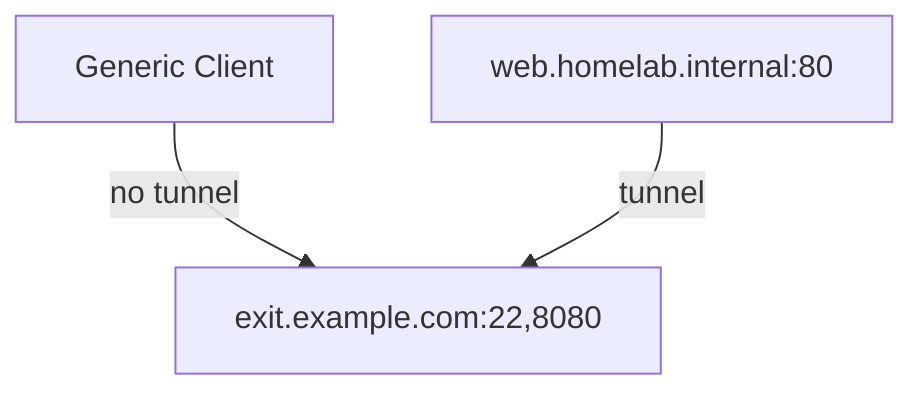
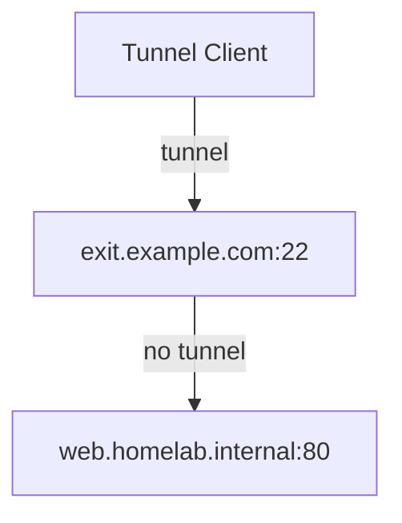
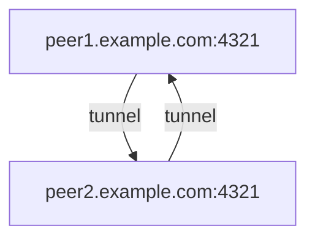

## Patch || Proxy

*the ins and outs of fortified tunneling*

note: 

- Objectives
	- overview of tunneling methods with a focus on self-hosting
- Outline
	- motivations, values
	- techniques
	- case studies
- Surveys?


---

## Hello 

:wave:<!-- element class="emoji" -->

**Kenneth Bingham**

w@qrk.us | *@qrkourier*

<style>
.emoji {
  font-size: 50px;
  display: inline-block;
  animation: rotate 9s infinite ease-in-out;
}

@keyframes rotate {
      0% {
        transform: rotate(10deg);
      }
      25% {
        transform: rotate(25deg);
      }
      50% {
        transform: rotate(0deg);
      }
      75% {
        transform: rotate(-10deg);
      }
      100% {
        transform: rotate(10deg);
      }
}
</style>

note:

- Day job is working on the OpenZiti community open-source project. Development is sponsored and led by NetFoundry Cloud

---

<!-- .slide bg="./patch-v-proxy/assets/mr-rabbit.png" -->

## How has Tunneling Changed?

*network-centric v. app-centric*

<grid drag="33 33" drop="1 -1" bg="black" opacity="50%" align="center"><!-- .element class="grid" -->

**VPN**

public gateway to a private subnet or exit node

</grid>

<grid drag="33 33" drop="-1 1" bg="black" opacity="50%" align="center" pad="8">

**Tunnel**

A public broker or relay for a private application

</grid>

note:

- for self-hosters, it's often less about building and bridging infrastructure and more about securing individual apps
- vpns for full-tunnel exit node, split-tunnel corporate network

---

<!-- .slide bg="patch-v-proxy/assets/hand-wrench.png" -->


<grid drag="88 33" drop="top" bg="lightblue" opacity="70%" align="center">

### Access my own stuff

</grid>

<grid drag="88 33" drop="center" bg="lightblue" opacity="60%" align="center">

## Uses

</grid>

<grid drag="88 33" drop="bottom" bg="lightblue" opacity="70%" align="center">

### Share my stuff with ppl

</grid>

note:

- Motivations to talk about tunneling
	- ultimately: how do I
		- access the galaxy of free software through self-hosting?
		- apply values like privacy and self-sufficiency
	- tunneling can be a confusing means to an end
		- many tunneling projects and products
	- public good - Can we decentralize important services to make them more resilient or less adversarial (surveillance driven)?
- Access my stuff from wherever
	- examples
		- remote admin SSH
		- private Git repo
		- Home Assistant
		- offline AI models
		- catch webhooks for integrations
	- always available to me
	- admin everywhere
	- simple enough for me to remember how it works
	- dedicated capacity - few performance concerns 
- Share my stuff
	- examples
		- send a big file(s)
		- Jitsi conference 
		- play Minecraft
	- also simple enough for my users to remember how it works 
	- temporary availability is a compelling counterpoint to authN and authZ
- Inviting others
	- more expensive resources, QoS, or try again later...
	- segmenting access is more complicated with authN and authZ v. admin everywhere

---
<!-- .slide bg="patch-v-proxy/assets/toothbrush.png" -->

## Production <!-- element id="heading" -->

<grid drag="88 33" drop="bottom" bg="beige" opacity="70%" align="center">

::: block <!-- element id="block" -->

> There are as many definitions as there are toothbrushes in the known universe.<!-- element id="quote" -->

:::

</grid>

<style>
	#heading{
		opacity: 80%;
		padding: 0.6em;
		font-size: 3em;
		background-color: beige;
		color: black;
	}
	#block{
		font-size: 33px;
		border-style: none;
	}
	#quote{
	}
</style>

note:

1. "production" is another way of saying "secure enough"
1. incremental security or begin with a more foundationally secure approach
   (instantly available for more useful, important things)
	1. start with permissive, eventually do a lot of work to create yet another permissive tunnel because it's challenging to qualify flows after they're in place
	2. start with restrictive and build meaningful policies for labeled entities as you go

---

<!-- .slide bg="./patch-v-proxy/assets/plumbing.png" -->

<grid drag="33 33" drop="center" flow="col" pad="0" bg="silver" opacity="0.8">


## The Plumbing 

</grid>

::: block <!-- element class="fragment fade-in" -->

<grid drag="33 33" drop="top" flow="col" pad="0" bg="silver" opacity="0.8">

### Provisioning

central v. distributed

</grid>

:::

::: block <!-- element class="fragment fade-in" -->

<grid drag="33 33" drop="bottom" flow="col" pad="0" bg="silver" opacity="0.8">

### Data

broker v. relay

transparent v. proxy

</grid>

:::

note:
- provisioning
	- central config, obedient daemons
	- agent-initiated (publish my file or socket)
- data
	- NAT-T broker facilitates direct P2P transport
		- service providers paying for bandwidth
		- ultra latency sensitive apps
	- 3p relay ideally has zero access to data
	- transport
		- TCP
		- UDP+flow control protocol
	- proxy
		- transparent w/ DNS (TPROXY v. ip route)
		- CONNECT, SOCKS, socket

---

<grid drag="50 50" drop="top">

## OpenSSH Reverse Tunnel

</grid>
<grid drag="50" drop="left">

```ssh
# public host sshd_config
GatewayPorts clientspecified
```

```bash
# server tunnel via public host
$ ssh -nNv \
    -R '*:8080:web.homelab.internal:80' \
    user@exit.example.com
```

```bash
# generic client GET web.homelab.internal:80
# by public DNS name
$ curl http://exit.example.com:8080
```

</grid>
<grid drag="50" drop="right">


</grid>

note:

- pros
	- permissionless, generic client access
	- only SSH server is exposed
	- this is the closest to modern tunneling with SSH
- cons
	- no retry without glue
	- tedious incantation
	- intricate alignment of keys, addresses, and ports 

---

<grid drag="50 50" drop="top">

## OpenSSH Port Forward

</grid>

<grid drag="50" drop="left">

```bash
# client tunnel
$ ssh -nNv \
    -L '127.80.80.0:8080:web.homelab.internal:80' \
	user@exit.example.com
```

```bash
# same device can GET web.homelab.internal:80 
#  by forward IP:port
$ curl http://127.80.80.0:8080
```
</grid>

<grid drag="50" drop="right">


</grid>

note:

- my first tunnel?
- pros:
	- immediate, simple
- cons
	- no client side DNS
	- no retry without glue
	- tedious incantation for each forward
	- intricate alignment of keys, addresses, and ports 

---

<grid drag="50 50" drop="top">

## OpenSSH Dynamic Proxy

</grid>

<grid drag="50" drop="left">

```bash
# client tunnel
ssh -nNvD 1080 user@exit.example.com
```

```bash
# GET web.homelab.internal:80
$ tsocks curl http://web.homelab.internal
```
</grid>
<grid drag="50" drop="right">


</grid>

note:

- example of direct, privilged access with bespoke client software
- pros:
	- SOCKS5 can forward DNS queries
- cons
	- 22/tcp is often blocked at egress
	- 22/tcp must be published to the internet
	- clients must be SOCKS aware
	- wrappers leverage LD_PRELOAD
	- intricate preconfiguration of pubkeys on each client

---

<grid drag="50 50" drop="top">

## Wireguard VPN

</grid>

<grid drag="50" drop="left">

```bash
# invent an address
ip address add dev wg0 10.0.0.1/24

# mutually authorized peers
wg set wg0 \
  listen-port 4321 \
  private-key /etc/wireguard/private.key \
  peer OxlmYnjEPfwVipblGPERvkWTJeORK9PO1MOFVkYll14= \
  allowed-ips 10.0.0.0/24 \
  endpoint peer2.example.com:4321
```

```bash
# peer can GET by IP
curl http://10.0.0.2:80
```
</grid>

<grid drag="50" drop="right">


</grid>

note:

- pros
	- secure infrastructure - always on (with retry, no keepalive needed)
	- exposed ports are hardened and challenging to discover
- cons
	- no DNS OTS
	- peers must be continually exposed (no NAT-T without glue)
	- no orchestration OTS: intricate preconfiguration of pubkeys on each node

---


- **Implementing Agent-based Solutions**
    - Using systemd to run a tunneling agent.
        - Step-by-step guide.
        - Key considerations and best practices.
    - Using Docker to run a tunneling agent.
        - Step-by-step guide.
        - Key considerations and best practices.
- **Implementing Agent-less Solutions**
    - Examples of Go and Python tunneling libraries.
        - Overview of popular libraries.
        - Code snippets and implementation guides.
        - Use cases and best practices.


---

## Where Permaculture & FOSS Converge

Sunday 10:00 @Altispeed

*Interested in permaculture design? Explore free & open information sharing, traditional agricultural methods and the technologies we use to monitor production, yields, energy usage and tooling.*


---

<!-- .slide bg="./patch-v-proxy/assets/microphone.png" style="background-color: rgba(0, 0, 0, 0.5);"-->

## What's on your mind?

The runner will bring the mic to you

---

<grid drag="44" drop="left">

## Resources

- **`/r/selfhosted`**
- Anders Pitman
	- Awesome Tunneling
	- IndieBits

</grid>

<grid drag="44" drop="right">

## Follow Up

**Kenneth Bingham**

w@qrk.us | *@qrkourier*


</grid>
